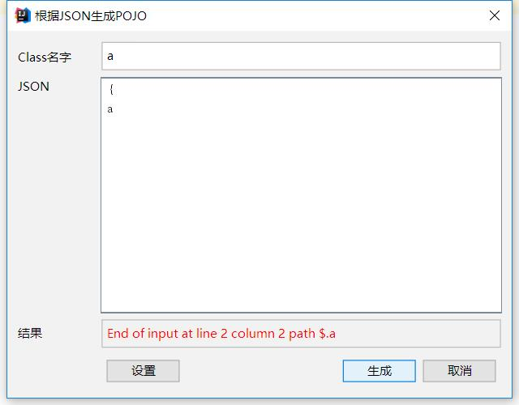
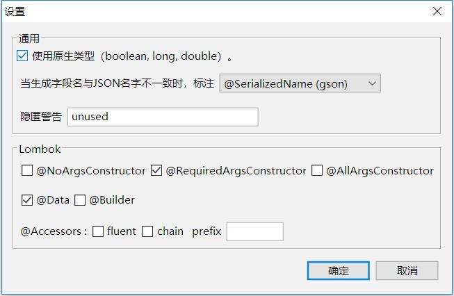

[English README](README.md)

## 简介
IntelliJ Idea插件，从JSON文本生成POJO, 并添加Lombok与Gson/Jackson注解.

## 安装
从plugin库marketplace搜索`json2pojo with Lombok`。

## 使用
1. 右键目标package，选择"New-> Convert JSON to POJOs"

2. 输入类名和源JSON文本。

## 配置

配置文件~/.json2pojo

    {
      "field.type.primitive": true,
      "field.name.annotation": 1,
      "lombok.accessors.fluent": false,
      "lombok.accessors.chain": false,
      "lombok.accessors.prefix": "",
      "lombok.builder": false,
      "lombok.data": true,
      "lombok.no.args.constructor": false,
      "lombok.required.args.constructor": true,
      "lombok.all.args.constructor": false,
      "suppress.warnings": "unused",
      "language": "en",
      "window.width": 512,
      "window.height": 400,
      "window.x": 648,
      "window.y": 252
    }

## Example

运行 `GeneratorTest`，生成的主类:

    package example.spark;

    import java.util.List;
    import com.google.gson.annotations.SerializedName;
    import lombok.Data;
    import lombok.RequiredArgsConstructor;

    @RequiredArgsConstructor
    @Data
    @SuppressWarnings("unused")
    public class SparkProgress {
        @SerializedName("batch.id")
        private long batchId;
        private DurationMs durationMs;
        private String id;
        @SerializedName("input-rows-per-second")
        private double inputRowsPerSecond;
        private String name;
        @SerializedName("num_input_rows")
        private long numInputRows;
        private double processedRowsPerSecond;
        private String runId;
        private Sink sink;
        private List<Source> sources;
        private List<StateOperator> stateOperators;
        private String timestamp;
    }

