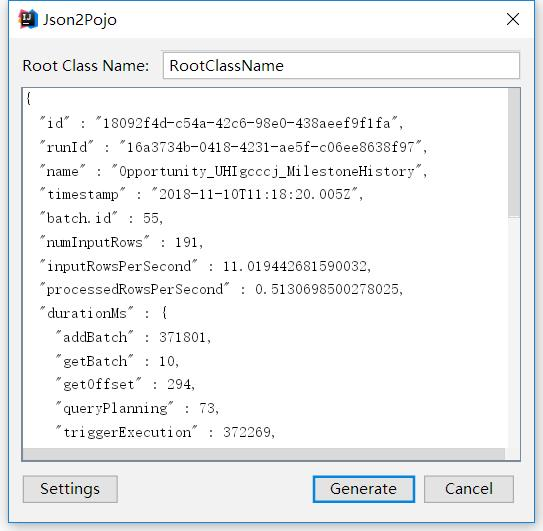
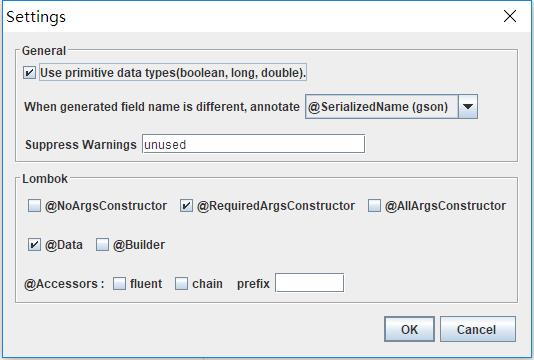

[中文 README](README.cn.md)

## Introduction
An IntelliJ Idea plugin which generate POJOs from JSON with Lombok and gson/jackson annotations.

## Installation
From IntelliJ Idea plugin marketplace search `json2pojo with Lombok`.

## Usage
1. From context of a package，select "New-> Generate POJOs from JSON".

2. Input root class name and source JSON.

## Settings

Settings file ~/.json2pojo

    {
      "primitive": true,
      "field.name.annotation": 1,
      "lombok.accessors": false,
      "lombok.accessors.fluent": true,
      "lombok.accessors.chain": true,
      "lombok.accessors.prefix": "",
      "lombok.builder": false,
      "lombok.data": true,
      "lombok.no.args.constructor": false,
      "lombok.required.args.constructor": true,
      "lombok.all.args.constructor": false
    }

## Example

Run `GeneratorTest`, generated root class:

    package example.spark;

    import java.util.List;
    import com.google.gson.annotations.SerializedName;
    import lombok.Data;
    import lombok.RequiredArgsConstructor;

    @RequiredArgsConstructor
    @Data
    @SuppressWarnings("unused")
    public class SparkProgress {
        @SerializedName("batch.id")
        private long batchId;
        private DurationMs durationMs;
        private String id;
        @SerializedName("input-rows-per-second")
        private double inputRowsPerSecond;
        private String name;
        @SerializedName("num_input_rows")
        private long numInputRows;
        private double processedRowsPerSecond;
        private String runId;
        private Sink sink;
        private List<Source> sources;
        private List<StateOperator> stateOperators;
        private String timestamp;
    }

